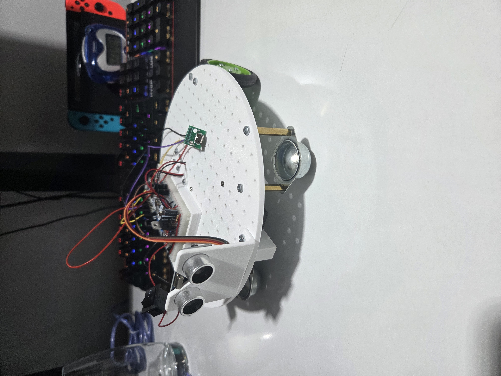
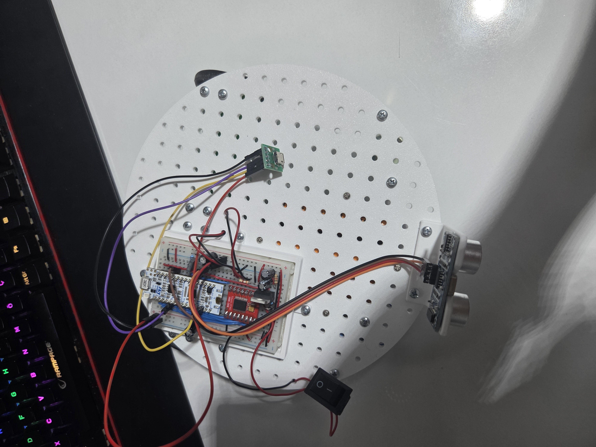
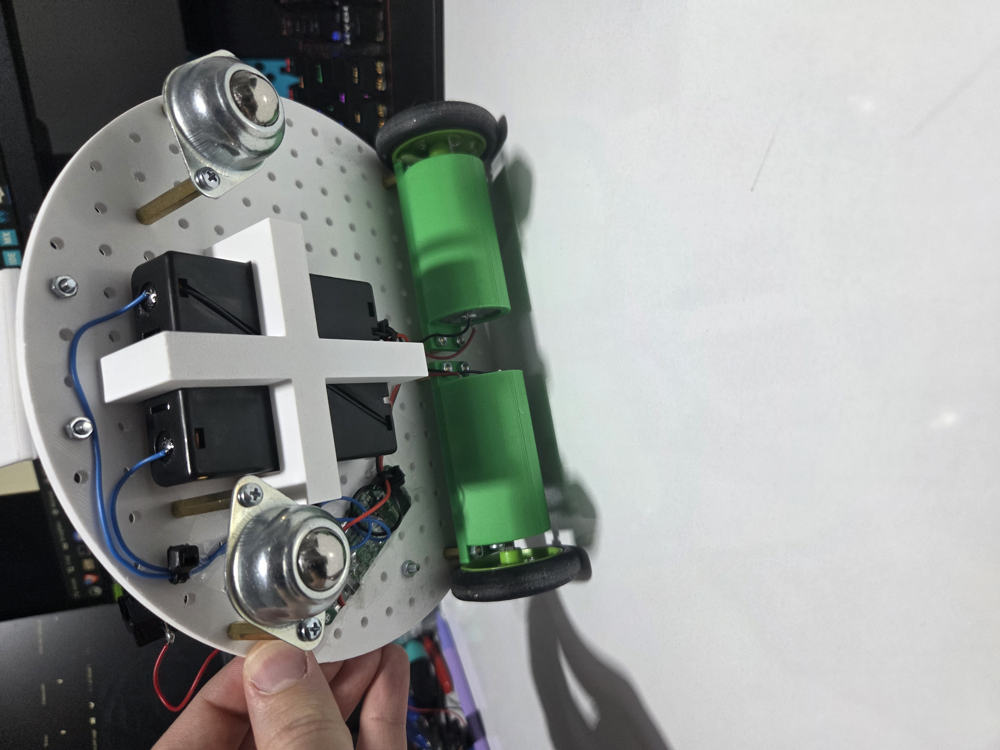

# Stryx

Stryx is a 3D printable wheeled robot designed as a platform for embedded software development. It has:
 - A power system that handles multiple power rails
 - An STM32 MCU (Nucleo L432KC) for controlling motors, sensors and potential future hardwares
 - An ultrasonic sensor for detecting obstacles
 - USB Connectivity
 - A modular platform that allows secure mounting
 - Various custom mounts

# Features
 - 3D printable parts (without supports)
 - Rear wheel drive via DC motors
 - Power system for managing different power rails
 - STM32 Nucleo L432KC MCU for real time control
 - Basic obstacle avoidance
 - DSP for removing sensor noises
 - Designed to be built on a mid-size breadboard for ease of prototyping and compactness
 - USB connectivity for universal communication (to be integrated better)

# Pictures
Below are the front, top and bottom views of Stryx.

# Videos
  - A video of Stryx moving can be viewed [here](https://youtube.com/shorts/t5ViIWTwRgw?feature=share).
  - A video of Stryx detection through the ultrasonic sensor can be viewed [here](https://youtu.be/18g5bbReIh8).

# Roadmap
Current plans to improve this project are in the following order:
 - Manual control combined with autonomous behavior for avoiding obstacles
 - Better sensing of environment with either
   1. More sensors
   2. Servos that control the orientation of sensors
   3. Or sensors that use different technologies such as IR or LiDAR

# Parts List
|Name|Amount|
|-----|-----|
|Mid-size breadboard|1|
|STM32 Nucleo L432KC Dev Board|1|
|USB Micro-B breakout board|1|
|TB6612FNG Module|1|
|12V 250RPM DC Motors|2|
|Omnidirectional Wheels|2|
|LM317T Voltage regulator |1|
|1N4001|3|
|0.1uF ceramic capacitor|2|
|1uF polarized capacitor|1|
|10uF polarized capacitor|1|
|470uF polarized capacitor|2|
|240Ω resistor|1|
|1kΩ resistor|2|
|3.8kΩ resistor|1|
|Neopixel LED Module|1|
|HC-SR04 ultrasonic sensor|1|
|3S 20A BMS|1|
|3200mAh Li-ion batteries|3|
|3S Li-ion battery holder|1|
|Switch (SPDT)|1|
|Rubber Wheels with D-Shaft connections|2|
|M3 screws, nuts, spacers and cables|various amounts|

# Schematic

Schematic is available in `kicad_files/` folder along with a PDF for quick viewing of the schematic.

Note: PDF may be outdated. KiCad project is the most up to date schematic.

# 3D Models

All 3D model files are in `3D_models/` folder along with printing instructions.

# How to build
## Mechanical
All parts are designed to align with the chassis mounting holes. Parts can be mounted wherever suitable, but keep in mind:
 - Wire lengths
 - Weight distribution and center of gravity
 - Accessibility

## Electronics
Components can be wired up according to the schematic in `kicad_files/`.

## Software
 1. Create a new STM32CubeIDE project using the `.ioc` file.
 2. Build the project.
 3. Connect the development board to the computer.
 4. Upload the firmware.
